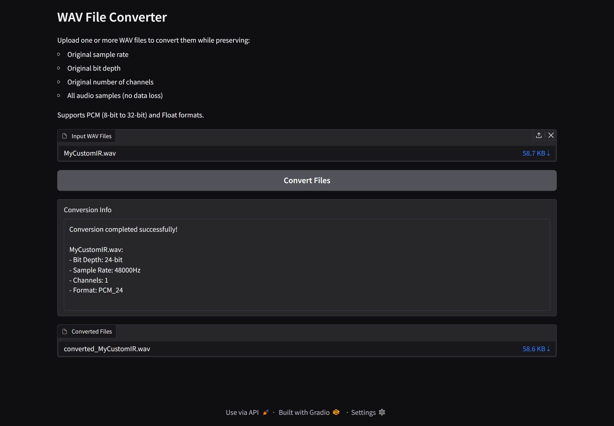

# WAV File Converter

This Python script provides a Gradio web interface for converting WAV audio files while preserving their original audio properties. It uses the `soundfile`, `numpy`, and `gradio` libraries.

## Features

*   Preserves original sample rate, bit depth, number of channels, and audio samples during conversion.
*   Supports PCM (8-bit to 32-bit) and Float WAV formats.
*   Provides a Gradio web interface for easy file uploads and conversion.
*   Displays conversion information, including bit depth, sample rate, channels, and format.

## Installation

1.  **Clone the Repository (Optional):** If you're working with a Git repository, clone it to your local machine:

    ```bash
    git clone https://github.com/paperworldcreation/wavIRconverter.git
    ```

2.  **Install Dependencies:**

    ```bash
    pip install -r requirements.txt
    ```

## Usage
1. Run the script
    ```bash
    python wavIRconverter.py 
    ```

2.  Open your web browser and go to the URL provided in the terminal (usually `http://127.0.0.1:7860/`).


3. Upload one or more WAV files using the file upload component.

4.  Click the "Convert Files" button.

5.  The converted files will be available for download, and conversion information will be displayed in the textbox.

## Dependencies

*   `gradio`
*   `numpy`
*   `soundfile`
*   `pathlib`

## Notice
The script was partially created with the help of generative AI
